# 12-Week LLM Inference Engineering Plan — v2 (Frontier-Lab Track)

> **Purpose:** Build the skills and evidence that frontier-lab inference teams hire for: performance modelling from first principles, GPU kernels, serving-engine internals, distributed and MoE inference, correctness at scale, and the ability to *build* an inference engine rather than only operate one.
>
> **Target workload:** 12–15 hours/week (baseline plan assumes 13.5h)

> **Cadence:** 6 build days + 1 benchmark/write-up day

> **Primary outcome:** A portfolio centred on a **from-scratch inference engine**, hand-written kernels with profiler evidence, measured experiments on modern serving techniques, and at least one merged upstream PR to vLLM or SGLang.

---

## 1. Target Role and Realistic Outcome

Frontier-lab inference roles (for example Anthropic's Inference and TPU Kernel roles, OpenAI's Inference Performance roles) consistently ask for:

- deep knowledge of **at least one accelerator ecosystem** (CUDA/GPU, TPU, or Trainium) and willingness to learn the others
- optimisation "from a kernel and data-movement perspective"
- CUDA, NCCL, NVLink/InfiniBand fluency
- intuition for how modern model architectures behave at inference time
- experience building and debugging production distributed systems

**Honest framing:** ~160 hours is enough to become a credible, well-evidenced candidate. It is not enough to become an expert in everything. Hiring signal comes from **depth in one or two areas**, so this plan includes a **spike track** (Section 7) that you pick at the end of Week 4 and pursue for the remaining eight weeks.

What most moves the needle, in order:

1. A from-scratch engine with honest benchmarks against vLLM/SGLang
2. Kernels with Nsight Compute evidence of how close they get to hardware limits
3. Merged upstream PRs
4. Fluent back-of-envelope performance reasoning in interviews

---

## 2. Learning Philosophy

### Target progression

```mermaid
flowchart LR
    A[Transformer + Napkin Math] --> B[GPU + CUDA + Profiling]
    B --> C[Triton + Attention Kernels]
    C --> D[Quantization + Low-bit GEMM]
    D --> E[vLLM V1 + SGLang Internals]
    E --> F[Build Your Own Engine]
    F --> G[Multi-GPU + NCCL]
    G --> H[MoE + Expert Parallelism]
    H --> I[Disaggregated + Long Context]
    I --> J[Speculative + Structured Decoding]
    J --> K[Correctness + RL + TPU]
    K --> L[Capstone: Engine v2 + Report]
```

### Core engineering loop — predict before you measure

v1's loop started at "understand mechanism". v2 adds a **prediction** step. Frontier interviewers probe exactly this: can you estimate the answer before running anything, and explain the gap afterwards?

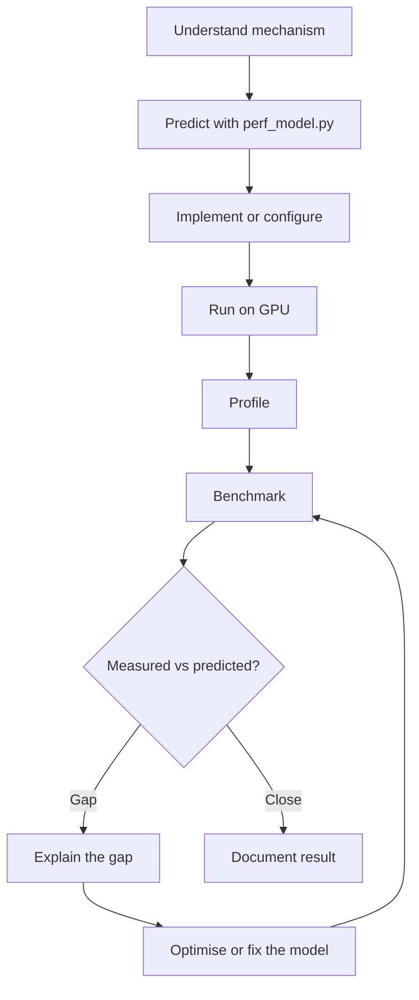

### The most important rules

> **1. Never claim an optimisation without a benchmark.**
> **2. Never claim an optimisation without a correctness check.**
> **3. Always write down your prediction first.**

A good inference engineer says:

> "Under this workload, on this GPU, with this model and configuration, this change produced this measured effect. I predicted X; I measured Y; the gap is explained by Z. Output parity with the reference holds to within this tolerance."

---

## 3. Prerequisites

You should already be comfortable with Python, PyTorch, Linux, Git, Docker and basic distributed systems.

**New in v2 — also needed:**

- **Basic C++** (pointers, templates, build systems). You will write CUDA C++ in Week 2. If rusty, spend 3–4 hours beforehand on a C++ refresher.
- **Basic linear algebra fluency** — matmul shapes, FLOP counting, and the memory footprint of a tensor.

You do not need to be a CUDA expert before starting.

---

## 4. Environment and GPU Budget

### Local (Mac)

Reading, source-code navigation, napkin math, `perf_model.py`, small CPU/MPS experiments, writing.

### Cloud GPU

Budget in **GPU-hours**, then multiply by your provider's current on-demand or spot rate. Script every experiment so that each session is *launch → run → collect → tear down*.

| Weeks | Hardware | Approx. usage |
|---|---|---|
| 1–3 | 1 × recent NVIDIA GPU (Hopper preferred; Ampere/Ada acceptable) | 8–12 GPU-h/week |
| 4 | 1 × GPU with FP8 support (Ada, Hopper or Blackwell) | ~12 GPU-h |
| 5–6 | 1 × GPU | 12–15 GPU-h/week |
| 7–8 | 1 node, 4–8 GPUs **with NVLink** | 5–8 node-h/week |
| 9 | 2–4 GPUs | ~6 node-h |
| 10–12 | 1–2 GPUs | 10–15 GPU-h/week |
| 11 | TPU for Pallas (Colab/Kaggle TPU runtime or TPU Research Cloud); Pallas also has a GPU backend | Free tier where possible |

**Rough total:** ~120–160 single-GPU hours plus ~15–25 multi-GPU node-hours.

Record for every run: GPU model, driver, CUDA, PyTorch, engine version and commit, and the exact flags.

---

## 5. Four Continuous Threads (run through all 12 weeks)

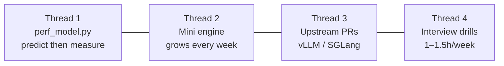

### Thread 1 — `perf_model.py`

Built in Week 1, extended every week: TP communication (Week 7), MoE and MLA (Week 8), KV transfer (Week 9), speculative decoding (Week 10). Every benchmark table gets a **Predicted** column.

### Thread 2 — Mini inference engine

Kernels from Weeks 3–4 plug into it. Built in Week 6, gains TP in Week 7, speculative decoding in Week 10, a parity test suite in Week 11, and is finished in Week 12.

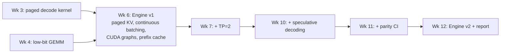

### Thread 3 — Upstream contribution

- **Week 2:** build vLLM and SGLang from source and run their test suites.
- **Week 5:** pick a `good first issue`, a docs gap you found while tracing source, or a small benchmark/bug fix.
- **Weeks 6–12:** aim for **1–2 merged PRs**. A merged PR is one of the strongest external signals you can show.

### Thread 4 — Interview drills

1–1.5 hours per week from Week 1. See Section 8.

---

## 6. Benchmark and Correctness Vocabulary

| Metric | Meaning |
|---|---|
| **TTFT** | Time to first token (includes queueing + prefill) |
| **TPOT / ITL** | Time per output token / inter-token latency; report P50, P95, P99 |
| **E2E latency** | Complete request latency |
| **Throughput** | Requests/s and tokens/s (input and output separately) |
| **Goodput** | Requests/s that **meet the SLO** — the metric that matters for serving |
| **MBU** | Model bandwidth utilisation: achieved bytes/s ÷ peak HBM bandwidth (key for decode) |
| **MFU** | Model FLOPs utilisation: achieved FLOP/s ÷ peak (key for prefill) |
| **KV-cache utilisation** | Fraction of KV blocks in use |
| **Prefix-cache hit rate** | Fraction of prompt tokens served from cache |
| **Acceptance rate / length** | Speculative tokens accepted per step |
| **KL vs reference** | Mean per-token KL divergence of next-token distributions against a reference implementation |
| **Top-1 agreement** | Fraction of positions where argmax matches the reference |
| **$/1M tokens at SLO** | Cost normalised by tokens, measured at the load where the SLO still holds |

### Always control

Model and revision · GPU type and count · driver/CUDA · engine version and commit · precision (weights, activations, KV) · dataset and prompt/output length distribution · arrival pattern (Poisson rate vs fixed concurrency) · sampling configuration · context length · scheduler flags (chunked prefill, token budget, prefix caching) · warm-up runs discarded.

---

# PHASE 1 — FOUNDATIONS AND KERNELS (Weeks 1–4)

---

# WEEK 1 — Transformer Inference from Scratch + Napkin Math

## Goal

Implement the full autoregressive inference path, and be able to **predict** its performance on any GPU before running it.

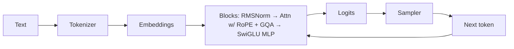

## Day 1 — Anatomy of a modern decoder

Learn: RMSNorm, RoPE, GQA/MQA, SwiGLU MLP, tied embeddings, residual stream.

**Exercise:** Load the config of a small model (e.g. Qwen3-0.6B or Llama-3.2-1B). Record hidden size, layers, query heads, KV heads, head dim, intermediate size and vocab. **Compute the parameter count by hand** and check it against the real count.

Resources: CS336 lectures, Karpathy "Let's build GPT", GQA paper, MQA paper.

## Day 2 — Attention

Implement causal scaled dot-product attention with RoPE, supporting MHA, GQA and MQA. **Test against the Hugging Face reference**: load real weights and report max-abs-error per layer.

## Day 3 — KV cache, prefill vs decode

Implement a contiguous KV cache. Separate `prefill()` from `decode_step()`. Compare full recompute with cached decoding.

## Day 4 — Sampling (and why it's a correctness surface)

Implement greedy, temperature, top-k, top-p and min-p, with seeded determinism. Write unit tests against fixed logits. Sampling bugs have caused real production quality incidents, so treat the sampler as production code.

## Day 5 — Napkin math I: reading

Read:

- Pope et al., *Efficiently Scaling Transformer Inference* (sections on inference cost and partitioning)
- *How to Scale Your Model*, inference chapter (and the "Serving LLaMA" applied chapter)
- Horace He, *Making Deep Learning Go Brrrr From First Principles*

Key ideas: ~2N FLOPs per token, bytes moved per decode step, and arithmetic intensity of prefill vs decode.

## Day 6 — Napkin math II: `perf_model.py`

Build a small calculator:

```text
inputs:  model config, hardware (peak FLOP/s, HBM GB/s, HBM GB, interconnect GB/s),
         precision (weights / activations / KV), batch, context, TP degree
outputs: weight bytes, KV bytes per token, max concurrent sequences,
         decode step lower bound, prefill time lower bound,
         critical batch size (memory-bound → compute-bound)
```

> **Worked example — Llama-3-70B, BF16, 8 × H100 SXM (spec sheet: 3.35 TB/s HBM, ~989 TFLOP/s dense BF16)**
>
> - Weights ≈ 70.6B × 2 B ≈ **141 GB** → ≈ 17.6 GB per GPU at TP=8
> - Decode step lower bound ≈ 17.6 GB ÷ 3.35 TB/s ≈ **5.3 ms** → at most ~190 tokens/s per sequence (ignores KV reads, communication and overhead)
> - Ridge point ≈ 989e12 ÷ 3.35e12 ≈ **295 FLOPs/byte**. With BF16 weights (2 FLOPs per 2 bytes, per token in the batch), decode stays **memory-bound until ~300 tokens are in flight** (ignoring KV traffic)
> - KV per token = 80 layers × 2 × 8 KV heads × 128 × 2 B = **320 KiB**
> - 64 sequences × 8K context ≈ **160 GiB** of KV. That fits in the ~500 GB left after weights across 8 GPUs
>
> Real kernels achieve less than spec. Measuring how much less, and explaining why, is the point of the rest of the plan.

## Day 7 — Project 1: `01-inference-from-scratch`

```text
01-inference-from-scratch/
├── README.md
├── model.py            # RMSNorm, RoPE, GQA attention, SwiGLU
├── kv_cache.py
├── sampling.py
├── perf_model.py
├── benchmark.py
├── tests/              # parity vs HF, sampler tests
└── results/
```

| Configuration | Predicted | Measured tok/s | Memory | Parity (max abs err) |
|---|---:|---:|---:|---:|
| No KV cache | | | | |
| KV cache, batch 1 | | | | |
| KV cache, batch 8 | | | | |

**Write-up:** "Predicted vs measured: where my performance model was wrong."

---

# WEEK 2 — GPU Architecture, CUDA and Profiling

## Goal

Know where time goes on a GPU, and write your first real kernels in CUDA C++.

## Day 8 — Execution model

SMs, warps, thread blocks, occupancy, Tensor Cores, streams, asynchronous execution, kernel launch overhead.

## Day 9 — Memory hierarchy and roofline

Registers → shared memory → L2 → HBM. Coalescing, bank conflicts, the roofline model. **Compute your GPU's ridge point.**

## Day 10 — CUDA C++ I: bandwidth-bound kernels

Vector add, then a reduction progressing from naive → shared memory → warp shuffle. Report achieved GB/s as a percentage of peak.

## Day 11 — CUDA C++ II: matmul

Follow Simon Boehm's *How to Optimize a CUDA Matmul Kernel* at least through shared-memory tiling and register blocking. Plot GFLOP/s vs cuBLAS at each step.

## Day 12 — Profiling

- PyTorch Profiler for op-level breakdown
- **Nsight Systems** for timelines: launch gaps, syncs, CPU stalls
- **Nsight Compute** for roofline position, memory throughput and occupancy per kernel

Profile your Week 1 model's decode step.

## Day 13 — Launch overhead, CUDA graphs, `torch.compile`

Capture the decode step in a CUDA graph and try `torch.compile`. Measure step time at batch 1 before and after. Explain why small-batch decode is often **CPU/launch-bound** rather than GPU-bound.

## Day 14 — Project 2: `02-gpu-kernels-and-profiling`

- CUDA reduction and matmul progression, with a performance table vs cuBLAS
- Roofline plot placing each kernel
- Decode-step profile with and without CUDA graphs
- **Upstream thread:** vLLM and SGLang built from source, tests passing

---

# WEEK 3 — Triton and Attention Kernels

## Goal

Write the kernels that dominate inference time.

## Day 15 — Triton fundamentals

Work through the official Triton tutorials (vector add, fused softmax, matmul) and learn autotuning.

## Day 16 — FlashAttention theory

Read FlashAttention and FlashAttention-2. **Derive online softmax by hand.** Understand tiling, recomputation and IO complexity.

## Days 17–18 — FlashAttention-2 forward in Triton

Implement a causal FA2 forward pass (CS336 Assignment 2 provides scaffolding). Test against PyTorch SDPA with BF16 tolerances. Benchmark across sequence lengths and head dims.

## Day 19 — Decode is a different problem

Why prefill-style kernels underuse the GPU when query length = 1. Read Flash-Decoding (split-K over the KV sequence). Read FlashAttention-3 at a conceptual level: Hopper warp specialisation, TMA, wgmma, FP8.

## Day 20 — Paged decode attention

Write a Triton decode kernel that reads K/V through a **block table** (paged layout). Compare against FlashInfer. Measure MBU with Nsight Compute.

## Day 21 — Project 3: `03-attention-kernels`

| Kernel | Shape | Your kernel | Reference | % of peak BW / FLOPs |
|---|---|---:|---:|---:|
| FA2 fwd (prefill) | | | SDPA | |
| Paged decode | | | FlashInfer | |

Include correctness tests and Nsight Compute screenshots with commentary.

---

# WEEK 4 — Quantization for Datacenter Inference

## Goal

Know which precision helps in which regime, on which hardware, and write a low-bit GEMM kernel.

## Day 22 — Number formats

BF16, FP8 (E4M3 / E5M2), INT8, INT4, and block-scaled microscaling formats (MXFP4, NVFP4). Range vs precision, scale factors and saturation. Read *FP8 Formats for Deep Learning* and the *Microscaling* paper.

## Day 23 — Scaling granularity and outliers

Per-tensor, per-channel, per-group, per-block (e.g. DeepSeek-V3's fine-grained FP8 scaling). Static vs dynamic activation scales. Activation outliers and why they motivated SmoothQuant.

## Day 24 — Algorithms

GPTQ, AWQ, SmoothQuant: what problem each solves. Quantize a model with GPTQModel, llm-awq or llm-compressor.

## Day 25 — Regime analysis (predict first)

- **Weight-only (W4A16, W8A16)** reduces bytes → helps memory-bound decode at small batch
- **W8A8 / FP8** doubles Tensor Core throughput → helps compute-bound prefill and large batches
- Dequantisation overhead can make INT4 *slower* at large batch

Predict with `perf_model.py`, then measure with vLLM at batch 1 / 32 / 256.

## Day 26 — Low-bit GEMM kernel

Write a W4A16 or W8A16 **dequantise-in-kernel** Triton GEMM for decode-shaped (skinny) matrices. Compare with Marlin.

## Day 27 — Quality, measured properly

Go beyond task accuracy:

- mean per-token **KL divergence** vs the BF16 baseline
- top-1 agreement
- perplexity on a held-out set
- a small task eval
- effect of **FP8 KV cache** on long-context quality

## Day 28 — Project 4: `04-quantization-lab`

| Precision | VRAM | Decode tok/s @ b=1 | Throughput @ b=256 | KL vs BF16 | Task score |
|---|---:|---:|---:|---:|---:|
| BF16 | | | | 0 | |
| FP8 W8A8 | | | | | |
| INT8 W8A8 | | | | | |
| INT4 W4A16 | | | | | |
| FP8 KV cache | | | | | |

**Report:** "FP8 vs INT8 vs INT4 vs MXFP4 — which regime, which hardware."

> ### End of Phase 1 — choose your spike track
>
> **Track A: Kernels and performance** or **Track B: Distributed serving and scheduling.** See Section 7. From Week 5, ~2.5 h/week goes to your spike.

---

# PHASE 2 — ENGINE INTERNALS (Weeks 5–6)

---

# WEEK 5 — Serving Engine Internals: vLLM V1 and SGLang

## Goal

Read the two leading open engines closely enough that you could rebuild them.

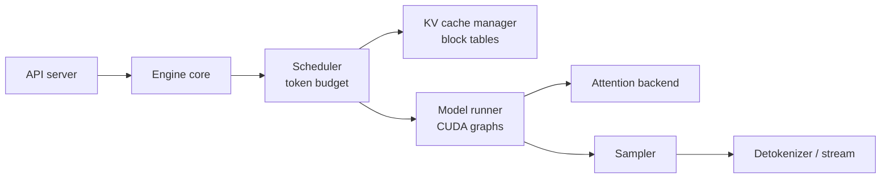

## Day 29 — Continuous batching and PagedAttention

Read Orca (iteration-level scheduling) and the PagedAttention paper. Cover block tables, fragmentation, and copy-on-write for parallel sampling.

## Day 30 — vLLM V1 architecture

Read the V1 announcement, then trace one request through the source: API server → engine core → scheduler (unified prefill/decode token budget) → KV cache manager → model runner → sampler → output. Note file and function names.

## Day 31 — SGLang

RadixAttention (tree-structured prefix cache), the overlap ("zero-overhead") scheduler that hides CPU work behind GPU work, and DP attention. Contrast SGLang's radix-tree prefix cache with vLLM's hash-based block caching.

## Day 32 — Chunked prefill

Read Sarathi-Serve. Why long prompts stall ongoing decodes, and how the per-step token budget trades TTFT against ITL.

## Day 33 — Benchmark methodology

- `vllm bench serve` and `python -m sglang.bench_serving`
- datasets: chat-like, long-prompt, and shared-prefix
- **Poisson request rate** vs fixed concurrency, and why they give different pictures
- P50/P95/P99 TTFT and ITL; goodput under an SLO

## Day 34 — Experiments

Same model, same GPU:

- vLLM vs SGLang across request rates
- chunked prefill on vs off
- prefix caching on vs off with a shared-prefix workload
- measured decode step time vs `perf_model.py` prediction

*Optional (1h):* skim TensorRT-LLM's architecture for comparison. Don't spend a week on it.

## Day 35 — Project 5: `05-engine-internals`

- Request-lifecycle trace document for vLLM V1 and SGLang, with file/function references
- Benchmark lab with plots
- **Upstream thread:** pick your first issue

---

# WEEK 6 — Build Your Own Engine (v1)

## Goal

Move from reading engines to building one. **This is the centrepiece of your portfolio.**

Study `nano-vllm` (a compact vLLM re-implementation) for structure, but **write your own**.

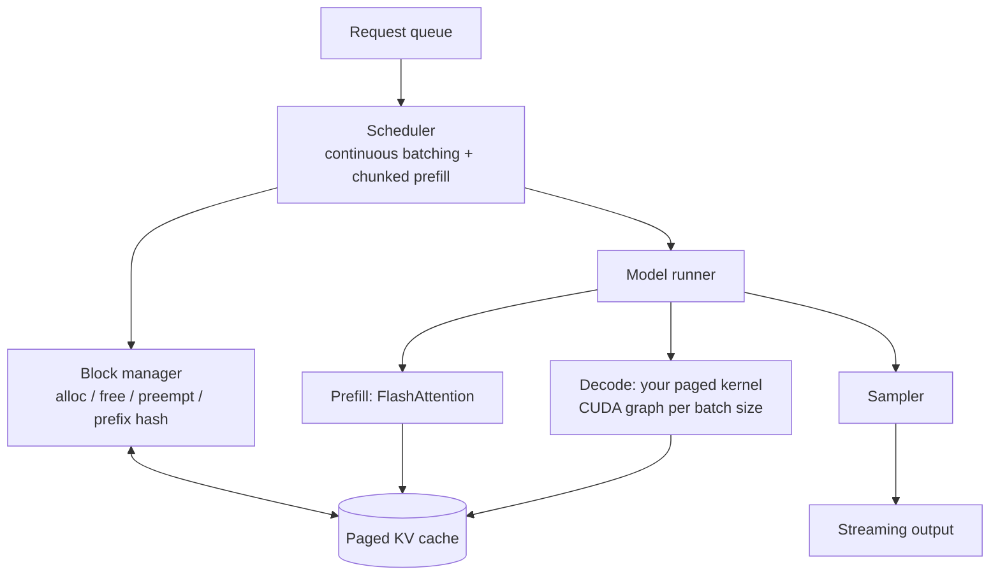

## Day 36 — Design doc

Components, data structures, scheduling policy and failure modes. Write it down before you code.

## Day 37 — Block manager

Fixed-size KV blocks, allocation, free lists, block tables, and preemption (recompute vs swap-to-CPU).

## Day 38 — Scheduler

Continuous batching with a token budget, mixed prefill + decode batches, chunked prefill.

## Day 39 — Model runner

Prefill through FlashAttention. Decode through your Week 3 paged kernel (or FlashInfer as a fallback). CUDA-graph capture for a set of decode batch sizes.

## Day 40 — Prefix caching

Hash-based block reuse with reference counts and LRU eviction.

## Day 41 — Benchmark vs vLLM

Same model, same GPU, same workload: throughput, TTFT and ITL across request rates. Use Nsight Systems to find where you lose time.

## Day 42 — Project 6: `06-mini-inference-engine` (v1)

**Write-up:** "Where my engine loses to vLLM, and why." Honest gaps are more impressive than inflated wins.

---

# PHASE 3 — SCALE (Weeks 7–9)

---

# WEEK 7 — Multi-GPU Inference and Communication

## Goal

Model, measure and implement distributed inference, not just "add GPUs".

## Day 43 — NCCL collectives

All-reduce, all-gather, reduce-scatter, all-to-all; ring vs tree algorithms. Run `nccl-tests` and plot bus bandwidth vs message size. Note that decode messages are small, so they are **latency-bound**, not bandwidth-bound.

## Day 44 — Tensor parallelism

Megatron column- and row-parallel linears, with two all-reduces per transformer layer. **Compute the communication volume per token** and add it to `perf_model.py`.

## Day 45 — The other parallelism axes

Pipeline parallelism (bubbles, and when it's worth it for inference), data-parallel replicas, expert parallelism (Week 8), and context parallelism (Week 9). Re-read the partitioning section of Pope et al.

## Day 46 — Topology

PCIe vs NVLink/NVSwitch vs InfiniBand/RoCE. Rack-scale NVLink domains (e.g. NVL72). Why TP usually stays inside one NVLink domain.

## Day 47 — Small-message communication

Custom one-shot/two-shot all-reduce in vLLM/SGLang, and compute–communication overlap. Measure the effect on decode ITL.

## Day 48 — Add TP=2 to your engine

Use `torch.distributed` + NCCL. **Verify output parity with TP=1** and measure scaling.

## Day 49 — Project 7: `07-multi-gpu-lab`

| GPUs | TP | Predicted step (compute + comm) | Measured step | Throughput | Scaling efficiency |
|---:|---:|---:|---:|---:|---:|
| 1 | 1 | | | | |
| 2 | 2 | | | | |
| 4 | 4 | | | | |
| 8 | 8 | | | | |

Include `nccl-tests` curves, mini-engine TP=2 results, and "why scaling is sub-linear", quantified.

---

# WEEK 8 — Mixture-of-Experts Inference

## Goal

Most frontier models are MoE, so this week matters. Understand how expert parallelism, all-to-all communication and load imbalance shape serving.

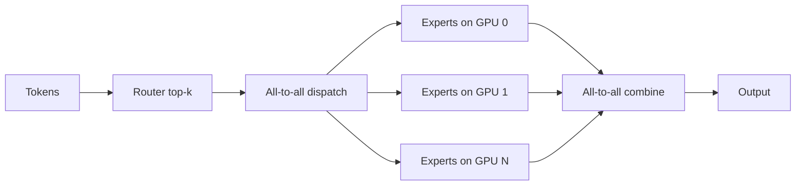

## Day 50 — MoE architecture

Gating, top-k routing, shared experts, capacity. Read the DeepSeek-V3 technical report (architecture and deployment sections).

## Day 51 — MLA

Multi-head latent attention: compressed latent KV and absorbed projections. **Calculate KV bytes per token for MLA vs GQA.** Read the FlashMLA repo.

## Day 52 — Expert parallelism

All-to-all dispatch and combine. DeepEP's high-throughput kernels (prefill) vs low-latency kernels (decode). The DP-attention + EP layout.

## Day 53 — Load imbalance

Hot experts, redundant experts (EPLB), and the effect on tail latency.

## Day 54 — Fused MoE kernel

Write a simple fused MoE Triton kernel (token permutation + grouped GEMM), or study vLLM's fused-MoE Triton kernel in depth. Benchmark against a naive per-expert loop. Read DeepGEMM.

## Day 55 — Serve a MoE

Serve a small MoE (e.g. Qwen3-30B-A3B or gpt-oss-20b) with vLLM or SGLang on 2–4 GPUs. Compare TP-only vs EP configurations and log the expert-load distribution.

## Day 56 — Project 8: `08-moe-inference-lab`

**Napkin-math exercise:** plan a DeepSeek-V3-class decode deployment. How many GPUs, what EP/DP layout, and what predicted tokens/s? Compare with DeepSeek's published inference-system overview and explain differences.

---

# WEEK 9 — Disaggregated, Cache-Aware and Long-Context Serving

## Goal

Understand the serving architectures frontier labs are moving to.

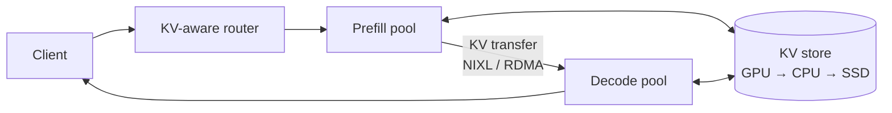

## Day 57 — Why disaggregate

Prefill/decode interference. DistServe (optimising goodput), Splitwise (phase-specific hardware).

## Day 58 — KV transfer

KV size for a given prompt; transfer time over NVLink vs RDMA vs recompute time. NIXL. Mooncake's KV-centric architecture. Add KV transfer cost to `perf_model.py`.

## Day 59 — KV memory hierarchy

GPU → CPU → SSD/remote offload (LMCache). When reloading beats recomputing, from napkin math.

## Day 60 — Cache-aware routing

Prefix-aware load balancing; llm-d and NVIDIA Dynamo. Sketch a KV-aware router design.

## Day 61 — Long context

- quadratic attention cost vs context length
- **context parallelism / ring attention** for long prefill (Meta's million-token CP paper)
- sliding-window and sparse attention (e.g. Native Sparse Attention)
- KV quantization (KIVI)
- hybrid attention/state-space architectures (overview only)

## Day 62 — Experiment

Run 1 prefill + 1 decode worker (vLLM or SGLang disaggregated mode with a NIXL or Mooncake connector) vs a colocated setup. Use a mixed workload of long prompts and chat, and measure **goodput under a TTFT + ITL SLO**. Derive the SLO from the workload rather than copying a number.

## Day 63 — Project 9: `09-disaggregated-serving-lab`

**Design note:** "When disaggregation pays off — and when it doesn't." Include autoscaling signals (queue depth, KV utilisation, token rate) for each pool.

---

# PHASE 4 — FRONTIER CONCERNS AND CAPSTONE (Weeks 10–12)

---

# WEEK 10 — Speculative Decoding and Structured Generation

## Goal

Understand speculative decoding mathematically, implement it correctly, and know exactly when it stops helping.

## Day 64 — Theory

Read Leviathan et al. Work through the rejection-sampling acceptance rule and **prove the output distribution is unchanged**. With per-token acceptance rate α and draft length γ, the expected tokens per target step is:

```text
E[tokens/step] = (1 − α^(γ+1)) / (1 − α)
```

Add this to `perf_model.py` with the draft-model cost.

## Day 65 — Variants

Draft models, n-gram/prompt lookup, Medusa, EAGLE-2 and EAGLE-3, multi-token-prediction (MTP) heads as in DeepSeek-V3, and tree attention for verification.

## Day 66 — Implement in your engine

Add a draft-model or n-gram speculator. Two correctness tests:

- **greedy:** output is identical to non-speculative
- **sampling (T > 0):** a statistical test that the token distribution matches non-speculative sampling

## Day 67 — Interaction with batch size

Why the speedup shrinks at large batch: decode becomes compute-bound, and verification spends FLOPs. Measure vLLM with EAGLE at batch 1 / 8 / 32 / 128.

## Day 68 — Structured output

Grammar-constrained decoding (XGrammar): token-mask computation cost, overlapping mask generation with the GPU, JSON and tool-call schemas.

## Day 69 — Sampling correctness on GPU

Top-k/top-p kernels, the pitfalls of approximate top-k, repetition penalties, and correct logprob reporting.

## Day 70 — Project 10: `10-speculative-decoding`

Plot acceptance length vs speedup vs batch size, with predicted and measured curves. Include a section on failure conditions.

---

# WEEK 11 — Correctness, Numerics, RL Rollouts and Other Accelerators

## Goal

At frontier scale, silent quality degradation is often a bigger risk than latency. Learn to detect it. Then broaden beyond NVIDIA.

## Day 71 — Nondeterminism and batch invariance

Floating-point non-associativity and why results change with batch composition. Read Thinking Machines' *Defeating Nondeterminism in LLM Inference*. **Reproduce** run-to-run divergence in vLLM by varying concurrency, and quantify it.

## Day 72 — Logprob-parity harness

Compare reference (HF, FP32/BF16) vs your engine vs vLLM on:

- per-token KL
- top-1 agreement
- max logprob difference
- divergence point over long generations

Make it a CI test for your engine.

## Day 73 — Postmortem case study

Read Anthropic's September 2025 postmortem of three infrastructure bugs that degraded response quality (a routing error, output corruption, and an approximate top-k compiler bug). For each bug, write down whether your parity harness and regression gate would have caught it, and what you would add if not.

## Day 74 — Inference for RL

Rollout generation at scale, weight sync from trainer to inference engine, on-policy vs stale weights, and the **training–inference logprob mismatch** and its effect on RL stability. Read the rollout/weight-sync code in verl or slime.

## Day 75 — JAX, TPU and Pallas

JAX basics (`jit`, sharding). TPU architecture via *How to Scale Your Model* (MXU, VMEM, ICI). Write one **Pallas** kernel (matmul or softmax) on a TPU runtime, or on Pallas's GPU backend.

## Day 76 — Trainium and AMD

Skim AWS Neuron's NKI kernel docs, and the key ROCm/MI300-class differences (64-wide wavefronts, larger HBM). Write one page on what transfers across accelerators (roofline thinking, tiling, overlap) and what doesn't (specific instructions, memory spaces, compiler stacks).

## Day 77 — Project 11: `11-inference-correctness`

- Parity harness and determinism report
- Automated regression gate:

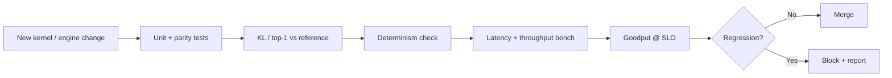

- The Pallas kernel and your cross-accelerator note

---

# WEEK 12 — Capstone: Engine v2 and Engineering Report

## Goal

Consolidate into one strong, honest artifact.

## Day 78 — Engine v2

Integrate TP=2, speculative decoding, your kernels and prefix caching. All parity tests pass.

## Day 79 — Spike deliverable

Finish the Week 12 milestone of your spike track (Section 7).

## Day 80 — Benchmark matrix

| Dimension | Values |
|---|---|
| Engine | Yours / vLLM / SGLang |
| Precision | BF16 / FP8 / INT4 where supported |
| Request rate | Low / medium / saturating |
| Workload | Chat / long-prompt / shared-prefix |
| Parallelism | TP=1 / TP=2 |
| Decoding | Normal / speculative |

Every row gets **Predicted** and **Measured** columns.

## Day 81 — One targeted optimisation

Find the largest bottleneck from profiling, make one change, and show before/after with parity preserved.

## Day 82 — Upstream

Land or finish your PR(s), and write a short post about what you learned from the review.

## Day 83 — Final report

> **Building and Benchmarking an LLM Inference Engine: Performance Models, Kernels, and Trade-offs**

1. Performance model and assumptions
2. Engine architecture
3. Kernels (with Nsight evidence)
4. KV-cache and scheduling strategy
5. Quantization choices
6. Parallelism (TP, and your MoE findings)
7. Speculative decoding
8. Correctness methodology (parity, determinism)
9. Benchmark methodology
10. Results: predicted vs measured
11. Where you lose to vLLM/SGLang, and why
12. Cost at SLO ($/1M tokens)
13. Limitations and future work

## Day 84 — Interview readiness

A full mock interview covering one napkin-math problem, one system design, one systems-coding problem and one project deep-dive (see Section 8). Polish READMEs.

---

# 7. Spike Tracks (choose one at the end of Week 4)

~2.5 hours/week from Week 5. The aim is one area where you are clearly **above** the generalist bar.

## Track A — Kernels and Performance

*Best fit for: inference performance / kernel engineer roles.*

| Weeks | Milestone |
|---|---|
| 5–6 | CUDA depth: *Programming Massively Parallel Processors* (key chapters), Tensor Cores via `mma.sync`; push your matmul toward cuBLAS |
| 7–8 | Hopper/Blackwell features: TMA, wgmma, warp specialisation, async pipelines. CUTLASS 3 / CuTe, or ThunderKittens |
| 9–10 | Build an optimised decode-attention **or** FP8 block-scaled GEMM; benchmark against FlashInfer / DeepGEMM with Nsight Compute analysis |
| 11–12 | Fused MoE or MLA decode kernel; aim for an upstream kernel contribution |

## Track B — Distributed Serving and Scheduling

*Best fit for: inference systems / deployment / platform roles.*

| Weeks | Milestone |
|---|---|
| 5–6 | Scheduling policies (FCFS, priority, SLO-aware), preemption. Build a **discrete-event simulator** of a serving system and validate it against real vLLM runs |
| 7–8 | Multi-node expert parallelism with DeepEP; all-to-all latency; failure and straggler handling |
| 9–10 | Build a KV/prefix-aware router over N workers; compare round-robin vs least-load vs prefix-aware on shared-prefix workloads |
| 11–12 | Fleet-level model: capacity planning ($/1M tokens at SLO), autoscaling signals, cold start and weight-loading speed, graceful drain |

---

# 8. Interview Preparation (Thread 4)

~1–1.5 hours/week. Rotate through the five categories below.

## 8.1 Napkin-math drills

Answer these on paper, then check with `perf_model.py` or a measurement:

1. Minimum decode latency for model X on hardware Y at TP=Z?
2. At what batch size does decode become compute-bound for BF16, FP8 and W4A16 weights?
3. How many concurrent 32K-context users fit for model X on 8 GPUs?
4. Prefill time for a 100K-token prompt? How does context parallelism change it?
5. All-reduce cost per decoded token at TP=8 over NVLink — what fraction of step time?
6. KV transfer time for a 32K prompt over 400 Gb/s RDMA vs recomputing it?
7. Expected speedup from speculative decoding with α = 0.7, γ = 4, draft cost = 10% of the target?
8. $/1M output tokens given GPU $/hour and measured goodput at SLO?
9. MoE: which of active vs total parameters determines memory, FLOPs, and decode bandwidth at small vs large batch?
10. Why can INT4 help at batch 1 but hurt at batch 256?

## 8.2 Systems coding (Python and C++)

- KV block allocator with reference counts and LRU eviction
- Vectorised top-p sampler with tests
- Radix-tree prefix cache: insert, match, evict
- Continuous-batching scheduler simulator with a token budget
- Ring all-reduce simulation
- Streaming detokenizer that handles multi-byte UTF-8 boundaries

## 8.3 System design prompts

- Serve a 70B dense chat model at N requests/s with P95 TTFT and ITL targets: hardware, parallelism, batching, autoscaling
- Serve a ~600B-class MoE: EP/DP layout, disaggregation, failure handling
- An RL rollout service: millions of samples per day, weight updates every few minutes
- Multi-tenant LoRA serving
- Safely rolling out a new kernel or precision across a fleet: canary, parity, quality gates, rollback
- Multi-region routing with prefix-cache affinity

## 8.4 Project deep-dives

Prepare three stories with numbers:

- a bug your parity harness caught
- a performance gap you explained with a profiler
- a trade-off you chose deliberately, and what it cost

## 8.5 Whiteboard fluency

Be able to draw and explain from memory: PagedAttention block tables, FlashAttention's online softmax, the speculative acceptance rule, Megatron TP communication, and DeepEP dispatch/combine.

---

# 9. Final Portfolio

```text
01-inference-from-scratch        # + perf_model.py
02-gpu-kernels-and-profiling     # CUDA C++
03-attention-kernels             # FA2 fwd + paged decode (Triton)
04-quantization-lab              # + low-bit GEMM kernel
05-engine-internals              # vLLM V1 + SGLang traces and benchmarks
06-mini-inference-engine         # ★ centrepiece (v1 → v2)
07-multi-gpu-lab
08-moe-inference-lab
09-disaggregated-serving-lab
10-speculative-decoding
11-inference-correctness
spike-<kernels|serving>/
upstream-contributions.md        # links to PRs
```

### Recommended structure for the engine

```text
mini-inference-engine/
├── README.md                 # headline results: predicted vs measured, vs vLLM/SGLang
├── docs/
│   ├── design.md
│   ├── request-lifecycle.md
│   └── report.md             # final engineering report
├── engine/
│   ├── scheduler.py
│   ├── block_manager.py
│   ├── prefix_cache.py
│   ├── model_runner.py
│   ├── sampler.py
│   ├── spec_decode.py
│   └── distributed.py        # TP
├── kernels/
│   ├── paged_decode_attn.py  # Triton
│   ├── w4a16_gemm.py         # Triton
│   └── fused_moe.py          # optional
├── perf_model/
├── tests/
│   ├── parity/               # vs HF reference: KL, top-1, logprob diff
│   ├── determinism/
│   └── unit/
├── benchmarks/
│   ├── configs/
│   ├── scripts/
│   └── results/
└── ci/                       # regression gate
```

---

# 10. What You Should Be Able to Explain After 12 Weeks

Answer without hand-waving, and **with numbers**.

## Performance modelling

- Estimate decode and prefill latency lower bounds for any model/GPU pair.
- Find the critical batch size where decode becomes compute-bound.
- Calculate KV memory for GQA and MLA models, and maximum concurrency.

## GPU and kernels

- Why is decode memory-bound and prefill compute-bound?
- What does FlashAttention change about memory traffic, and why is decode attention a different kernel?
- What limits a kernel's performance, and how do you tell from Nsight Compute?
- Why do CUDA graphs matter for small-batch decode?

## Quantization

- When does weight-only quantization help, and when does W8A8/FP8 help?
- How do scaling granularity and microscaling formats affect accuracy?
- How do you measure quality loss beyond benchmark accuracy?

## Serving engines

- How do vLLM V1 and SGLang schedule, allocate KV and cache prefixes, and how do they differ?
- How does chunked prefill trade TTFT against ITL?
- What is goodput, and why optimise for it instead of raw throughput?

## Distributed and MoE

- What is the communication cost of TP per token, and why does TP stay inside an NVLink domain?
- How do expert parallelism and all-to-all work, and why do low-latency decode kernels differ from prefill kernels?
- How does expert load imbalance affect tail latency?

## Modern serving architecture

- When does prefill/decode disaggregation pay off?
- When is reloading KV from CPU/SSD better than recomputing it?
- How do you serve million-token contexts?

## Advanced decoding

- Why does speculative decoding preserve the output distribution?
- What determines its speedup, and why does that shrink at large batch?
- How does constrained decoding work, and what does it cost?

## Correctness and RL

- Why are LLM inference results nondeterministic, and what is batch invariance?
- How do you prove an optimised engine matches a reference?
- Why does training–inference mismatch matter for RL, and how are weights synced to rollout engines?

## Hardware breadth

- How do TPU and Trainium differ from GPUs architecturally, and what transfers across?

---

# 11. Weekly Definition of Done

Do not move to the next week until you have:

- [ ] Completed the core reading
- [ ] **Written a prediction** before running the main experiment
- [ ] Implemented the week's main concept
- [ ] **Checked correctness** (parity or unit tests) for anything you optimised
- [ ] Collected measurements under controlled conditions
- [ ] Explained the predicted-vs-measured gap
- [ ] Committed code, updated README, recorded hardware/software versions
- [ ] Completed one interview drill
- [ ] Made progress on the upstream thread (from Week 5)
- [ ] Written at least one "what surprised me" observation

---

# 12. Reading List

## Courses and guides

- Stanford CS336 — https://cs336.stanford.edu/ · Assignment 2 (systems, FlashAttention-2 in Triton): https://github.com/stanford-cs336/assignment2-systems
- Karpathy, Neural Networks: Zero to Hero — https://github.com/karpathy/nn-zero-to-hero
- *How to Scale Your Model* — https://jax-ml.github.io/scaling-book/ · Inference: https://jax-ml.github.io/scaling-book/inference · Serving LLaMA: https://jax-ml.github.io/scaling-book/applied-inference
- Horace He, *Making Deep Learning Go Brrrr* — https://horace.io/brrr_intro.html
- Simon Boehm, *How to Optimize a CUDA Matmul Kernel* — https://siboehm.com/articles/22/CUDA-MMM
- GPU MODE lectures — https://github.com/gpu-mode/lectures
- Triton tutorials — https://triton-lang.org/main/getting-started/tutorials/
- JAX Pallas — https://docs.jax.dev/en/latest/pallas/index.html
- AWS Neuron NKI — https://awsdocs-neuron.readthedocs-hosted.com/en/latest/nki/index.html
- *Programming Massively Parallel Processors* (Hwu, Kirk, El Hajj) — book

## Papers by topic

**Foundations**
- Attention Is All You Need — https://arxiv.org/abs/1706.03762
- MQA: Fast Transformer Decoding — https://arxiv.org/abs/1911.02150
- GQA — https://arxiv.org/abs/2305.13245
- Efficiently Scaling Transformer Inference — https://arxiv.org/abs/2211.05102

**Attention kernels**
- FlashAttention — https://arxiv.org/abs/2205.14135
- FlashAttention-2 — https://arxiv.org/abs/2307.08691
- FlashAttention-3 — https://arxiv.org/abs/2407.08608
- Flash-Decoding — https://crfm.stanford.edu/2023/10/12/flashdecoding.html
- FlashInfer — https://arxiv.org/abs/2501.01005

**Quantization**
- FP8 Formats for Deep Learning — https://arxiv.org/abs/2209.05433
- Microscaling Data Formats — https://arxiv.org/abs/2310.10537
- GPTQ — https://arxiv.org/abs/2210.17323
- AWQ — https://arxiv.org/abs/2306.00978
- SmoothQuant — https://arxiv.org/abs/2211.10438
- MARLIN — https://arxiv.org/abs/2408.11743
- KIVI (KV-cache quantization) — https://arxiv.org/abs/2402.02750

**Serving systems**
- Orca — https://www.usenix.org/conference/osdi22/presentation/yu
- PagedAttention / vLLM — https://arxiv.org/abs/2309.06180
- SGLang — https://arxiv.org/abs/2312.07104
- Sarathi-Serve — https://arxiv.org/abs/2403.02310
- DistServe — https://arxiv.org/abs/2401.09670
- Splitwise — https://arxiv.org/abs/2311.18677
- Mooncake — https://arxiv.org/abs/2407.00079

**Distributed and MoE**
- Megatron-LM — https://arxiv.org/abs/1909.08053
- DeepSeek-V2 (MLA) — https://arxiv.org/abs/2405.04434
- DeepSeek-V3 Technical Report — https://arxiv.org/abs/2412.19437

**Long context**
- Ring Attention — https://arxiv.org/abs/2310.01889
- Context Parallelism for Million-Token Inference — https://arxiv.org/abs/2411.01783
- Native Sparse Attention — https://arxiv.org/abs/2502.11089

**Speculative and structured decoding**
- Speculative Decoding (Leviathan et al.) — https://arxiv.org/abs/2211.17192
- Medusa — https://arxiv.org/abs/2401.10774
- EAGLE — https://arxiv.org/abs/2401.15077
- EAGLE-2 — https://arxiv.org/abs/2406.16858
- EAGLE-3 — https://arxiv.org/abs/2503.01840
- XGrammar — https://arxiv.org/abs/2411.15100

**Correctness**
- Defeating Nondeterminism in LLM Inference — https://thinkingmachines.ai/blog/defeating-nondeterminism-in-llm-inference/
- Anthropic, A postmortem of three recent issues — https://www.anthropic.com/engineering/a-postmortem-of-three-recent-issues

## Engine docs and blogs

- vLLM docs — https://docs.vllm.ai/ · V1 announcement: https://vllm.ai/blog/2025-01-27-v1-alpha-release
- vLLM prefix caching design — https://docs.vllm.ai/en/latest/design/prefix_caching/
- vLLM speculative decoding — https://docs.vllm.ai/en/latest/features/speculative_decoding/
- SGLang v0.4 (overlap scheduler, DP attention) — https://lmsys.org/blog/2024-12-04-sglang-v0-4/

## Repositories

| Area | Repos |
|---|---|
| Engines | vLLM https://github.com/vllm-project/vllm · SGLang https://github.com/sgl-project/sglang · nano-vllm https://github.com/GeeeekExplorer/nano-vllm · TensorRT-LLM (optional) https://github.com/NVIDIA/TensorRT-LLM |
| Kernels | FlashAttention https://github.com/Dao-AILab/flash-attention · FlashInfer https://github.com/flashinfer-ai/flashinfer · CUTLASS https://github.com/NVIDIA/cutlass · ThunderKittens https://github.com/HazyResearch/ThunderKittens · Marlin https://github.com/IST-DASLab/marlin |
| MoE | DeepEP https://github.com/deepseek-ai/DeepEP · DeepGEMM https://github.com/deepseek-ai/DeepGEMM · FlashMLA https://github.com/deepseek-ai/FlashMLA · EPLB https://github.com/deepseek-ai/EPLB |
| Quantization | GPTQModel https://github.com/ModelCloud/GPTQModel · llm-awq https://github.com/mit-han-lab/llm-awq |
| Communication | nccl-tests https://github.com/NVIDIA/nccl-tests · NIXL https://github.com/ai-dynamo/nixl |
| Disaggregation / routing | Dynamo https://github.com/ai-dynamo/dynamo · llm-d https://github.com/llm-d/llm-d · LMCache https://github.com/LMCache/LMCache |
| Structured output | XGrammar https://github.com/mlc-ai/xgrammar |
| RL rollouts | verl https://github.com/verl-project/verl · slime https://github.com/THUDM/slime |

---

# 13. Weekly Time Budget

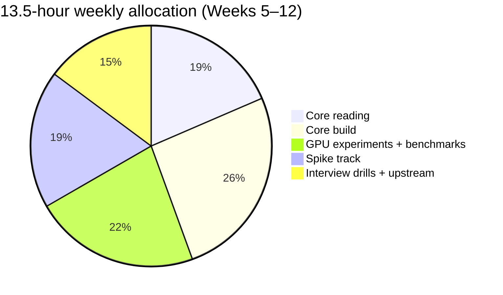

In Weeks 1–4 the spike time goes to core build.

| Day | Time | Activity |
|---|---:|---|
| Monday | 1.5h | Papers / theory |
| Tuesday | 1.5h | Source reading |
| Wednesday | 2h | Core build |
| Thursday | 1.5h | Spike track |
| Friday | 1h | Interview drill or upstream PR |
| Saturday | 4h | GPU session: experiments + spike (scripted, launch → tear down) |
| Sunday | 2h | Benchmark analysis + write-up |
| **Total** | **13.5h** | |

---

# 14. The 12-Week End State

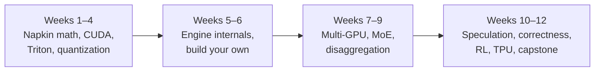

Your portfolio should demonstrate:

```text
I can predict performance from first principles
        +
I can write and profile GPU kernels
        +
I have built an inference engine, not just configured one
        +
I understand scheduling, KV caching and quantization trade-offs
        +
I understand distributed and MoE inference
        +
I can prove my optimisations are correct
        +
I have contributed upstream
        +
I am deep in one area (my spike)
```

That is the profile frontier-lab inference teams hire for.

